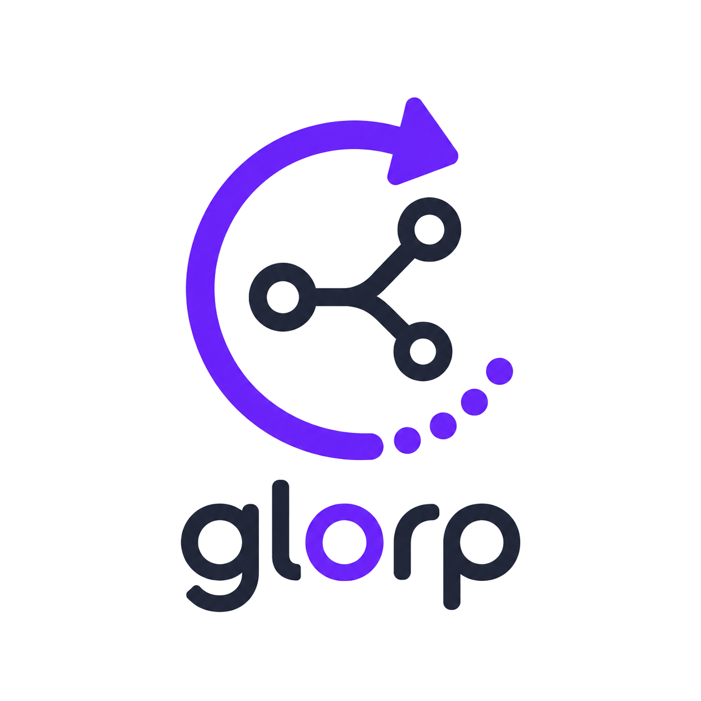

<p align="center">
  
</p>

# glorp

**Git Loop fOr Robot Patchers** — a near automated loop for building. Open issues on GitHub, let the 🤖s handle the rest.

glorp runs a daemon that watches (push or poll) GitHub repositories or project boards for issues and spins up a Claude or Codex agent for each detected issue with a configurable concurrency, tracking the issue to completion.

> [!NOTE]
> glorp launches agents non-interactively. Agent sandbox and permission controls remain enabled by default. `--yolo` disables those protections; use it only with repositories and issues whose contents you trust.

## Prerequisites

Install and configure these tools before installing glorp:

- [GitHub CLI](https://cli.github.com/) (`gh`), authenticated with access to every repository glorp will watch.
- [Node.js](https://nodejs.org/) and `npx`. The installer uses `npx` to install the bundled `gh-fix` skill through skills.sh.
- [ngrok](https://ngrok.com/) for the default webhook mode. Configure its authentication before starting glorp. ngrok is not required with `--poll`.
- At least one supported coding agent: [Codex CLI](https://developers.openai.com/codex/cli/) (`codex`) or [Claude Code](https://docs.anthropic.com/en/docs/claude-code) (`claude`).

The Unix installer also requires `curl` and standard archive tools. The Windows installer requires PowerShell.

Authenticate the GitHub CLI before running glorp:

```sh
gh auth login
```

Repository targets require permission to read issues, manage glorp's labels, and manage webhooks unless `--poll` is used. GitHub Project targets require the `read:project` scope to list items and the `project` scope to update their status:

```sh
gh auth refresh -s read:project -s project
```

## Installation

On macOS or Linux:

```sh
curl -fsSL https://github.com/lsegal/glorp/releases/latest/download/install.sh | bash
```

The script downloads the release for the current operating system and architecture, installs `glorp` into `~/.local/bin`, and installs the repository's `gh-fix` skill globally for Codex and Claude Code through skills.sh.

On Windows PowerShell:

```powershell
irm https://github.com/lsegal/glorp/releases/latest/download/install.ps1 | iex
```

The PowerShell installer places `glorp.exe` in `%USERPROFILE%\AppData\Local\glorp`, adds that directory to the user `PATH`, and installs the same `gh-fix` skill through skills.sh. Restart the terminal if `glorp` is not immediately found.

Installer behavior can be overridden with environment variables:

| Variable | Purpose | Default |
| --- | --- | --- |
| `GLORP_REPO` | Repository from which to download glorp and install `gh-fix` | `lsegal/glorp` |
| `GLORP_VERSION` | Release tag to install, or `latest` | `latest` |
| `GLORP_BIN_DIR` | Destination directory for the executable | `~/.local/bin` on Unix; `%USERPROFILE%\AppData\Local\glorp` on Windows |

The public `.agents/skills/gh-fix` directory in this repository is the skills.sh package source.

## Quick start

Options must appear before the first target. A target can be an `OWNER/REPO`, a GitHub repository URL, or a GitHub Project URL.

Watch a repository using the default Codex agent and webhook mode:

```sh
glorp owner/repo
```

By default, repository targets select open issues authored by the authenticated GitHub user. Watch all open issues instead:

```sh
glorp --all-issues owner/repo
```

Select issues using GitHub issue-search syntax:

```sh
glorp --filter "label:agent-ready" --filter "-label:blocked" owner/repo
```

Run without ngrok or managed webhooks by polling every 30 seconds:

```sh
glorp --poll --interval 30s owner/repo
```

Disable the interactive dashboard and print normal timestamped logs even when stdout is a terminal:

```sh
glorp --no-ui owner/repo
```

Use Claude Code and run up to three agent jobs concurrently:

```sh
glorp --agent claude --concurrency 3 owner/repo
```

Allow agents to run without sandbox or permission checks:

```sh
glorp --yolo owner/repo
```

Watch several repositories and projects in one process:

```sh
glorp --concurrency 3 owner/first owner/second https://github.com/orgs/example/projects/3
```

The concurrency limit is shared across all targets. GitHub webhook deliveries cause an immediate refresh, while `--interval` controls the periodic synchronization cadence.

## How it works

In the default mode, glorp:

1. Starts a webhook listener on a randomly assigned available port.
2. Starts an ngrok tunnel for that listener.
3. Creates a GitHub webhook for each repository target and removes stale ngrok webhooks previously managed for it.
4. Queries GitHub for matching open issues and queues previously unhandled work.
5. Starts the selected agent with `/gh-fix ISSUE_NUMBER` and tracks its output and result.

glorp creates and manages the `agent-ready` and `agent-started` labels for repository targets. While an agent is running, it applies `agent-started` and removes it after the agent exits. Project items are moved through their configured status as work starts and finishes.

Handled issues and active sessions are stored in `.glorp.json` by default. This prevents duplicate work after a restart and allows glorp to reclaim interrupted jobs. Issues that declare dependencies using `depends on #123` or GitHub's issue-dependency relationship remain blocked until those dependencies close.

When stdout is a terminal, glorp displays an interactive dashboard unless `--no-ui` is set. With `--no-ui` or non-terminal output, it writes timestamped progress to stdout, including issue counts, queued and active jobs, webhook events, retries, completions, failures, and shutdown progress.

## CLI reference

```text
glorp [options] TARGET [TARGET ...]
```

| Option | Default | Description |
| --- | --- | --- |
| `-h`, `--help` | — | Print command usage and option defaults. |
| `--version` | `false` | Print the glorp version and exit. |
| `--agent NAME` | `codex` | Agent to run. Supported values are `codex` and `claude`. |
| `--all-issues` | `false` | Disable the default issue-search filter and consider all open issues. |
| `--claude-binary PATH` | `claude` | Claude Code executable name or path. |
| `--codex-binary PATH` | `codex` | Codex executable name or path. |
| `--concurrency N` | `0` | Maximum concurrent agents across all targets. `0` is normalized to `3`; negative values are invalid. |
| `--filter QUERY` | `is:issue state:open author:@me` | GitHub issue-search filter. Repeat the option to combine terms. The default author filter applies to repository targets; Project targets default to all open project issues. |
| `--interval DURATION` | `30s` | Periodic GitHub synchronization interval. Uses Go duration syntax such as `10s`, `2m`, or `1h30m`; must be positive. |
| `--listen ADDRESS` | `:0` | Address for the local GitHub webhook HTTP server. Port `0` selects an available port automatically. |
| `--model MODEL` | agent default | Model passed to the selected agent. |
| `--model-level LEVEL` | agent default | Reasoning or effort level passed to the selected agent. Supported values are `low`, `medium`, and `high`. |
| `--ngrok-api URL` | `http://127.0.0.1:4040` | URL of the ngrok local API used to discover the public tunnel. |
| `--ngrok-binary PATH` | `ngrok` | ngrok executable name or path. |
| `--no-ui` | `false` | Disable the interactive terminal dashboard and write normal logs to stdout. |
| `--poll` | `false` | Use polling without starting ngrok or configuring GitHub webhooks. |
| `--state PATH` | `.glorp.json` | File used to persist handled issues and active session state. |
| `--webhook-path PATH` | `/webhook` | HTTP path that accepts GitHub webhook deliveries. |
| `--webhook-secret SECRET` | empty | Shared secret used to verify GitHub `X-Hub-Signature-256` signatures. The same secret is set when glorp creates each webhook. |
| `--yolo` | `false` | Disable the selected agent's sandbox, approval, and permission checks. Codex receives `--dangerously-bypass-approvals-and-sandbox`; Claude receives `--dangerously-skip-permissions`. |

Supported target forms are:

```text
owner/repository
https://github.com/owner/repository
https://github.com/users/OWNER/projects/NUMBER
https://github.com/orgs/OWNER/projects/NUMBER
https://github.com/OWNER/REPOSITORY/projects/NUMBER
```

Press `q` or `Ctrl+C` to exit the interactive dashboard. glorp waits for running agents during shutdown.
