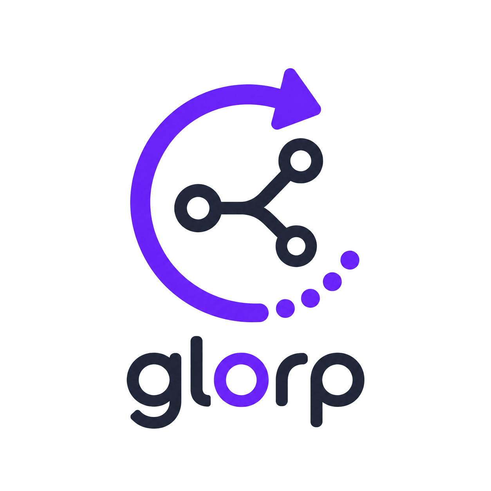

<p align="center">
  
</p>

# glorp

**Git Loop fOr Robot Patchers** — a near automated loop for building. Open issues on GitHub, let the 🤖s handle the rest.

glorp runs a daemon that watches (push or poll) GitHub repositories or project boards for issues and spins up a Claude or Codex agent for each detected issue with a configurable concurrency, tracking the issue to completion.

> [!NOTE]
> glorp launches agents non-interactively. Agent sandbox and permission controls remain enabled by default. `--yolo` disables those protections; use it only with repositories and issues whose contents you trust.

## Prerequisites

Install and configure these tools before installing glorp:

- [GitHub CLI](https://cli.github.com/) (`gh`), authenticated with access to every repository glorp will watch.
- [Node.js](https://nodejs.org/) and `npx`. The installer uses `npx` to install the bundled `gh-fix` and `gh-discuss` skills through skills.sh.
- [ngrok](https://ngrok.com/) for the default webhook mode. Configure its authentication before starting glorp. ngrok is not required with `--poll`.
- At least one supported coding agent: [Codex CLI](https://developers.openai.com/codex/cli/) (`codex`) or [Claude Code](https://docs.anthropic.com/en/docs/claude-code) (`claude`).

The Unix installer also requires `curl` and standard archive tools. The Windows installer requires PowerShell.

Authenticate the GitHub CLI before running glorp:

```sh
gh auth login
```

Repository targets require permission to read issues, manage glorp's labels, and manage webhooks unless `--poll` is used. GitHub Project targets require the `read:project` scope to list items and the `project` scope to update their status. Push mode for organization-owned Projects also requires organization-owner access and the `admin:org_hook` scope:

```sh
gh auth refresh -s read:project -s project
gh auth refresh -s admin:org_hook # organization Project push mode only
```

## Installation

On macOS or Linux:

```sh
curl -fsSL https://github.com/lsegal/glorp/releases/latest/download/install.sh | bash
```

The script downloads the release for the current operating system and architecture, installs `glorp` into `~/.local/bin`, and installs the repository's `gh-fix` and `gh-discuss` skills globally for Codex and Claude Code through skills.sh.

On Windows PowerShell:

```powershell
irm https://github.com/lsegal/glorp/releases/latest/download/install.ps1 | iex
```

The PowerShell installer places `glorp.exe` in `%USERPROFILE%\AppData\Local\glorp`, adds that directory to the user `PATH`, and installs the same `gh-fix` and `gh-discuss` skills through skills.sh. Restart the terminal if `glorp` is not immediately found.

Installer behavior can be overridden with environment variables:

| Variable | Purpose | Default |
| --- | --- | --- |
| `GLORP_REPO` | Repository from which to download glorp and install `gh-fix`/`gh-discuss` | `lsegal/glorp` |
| `GLORP_VERSION` | Release tag to install, or `latest` | `latest` |
| `GLORP_BIN_DIR` | Destination directory for the executable | `~/.local/bin` on Unix; `%USERPROFILE%\AppData\Local\glorp` on Windows |

The public `.agents/skills/gh-fix` and `.agents/skills/gh-discuss` directories in this repository are the skills.sh package sources.

### Upgrading

```sh
glorp upgrade
```

The command re-runs the installer for the current platform, so it picks up the latest release along with the current `gh-fix` skill. `GLORP_REPO` and the other installer environment variables above still apply.

## Quick start

Every glorp invocation starts with a subcommand:

| Command | Description |
| --- | --- |
| `glorp watch [flags] [TARGET ...]` | Watch GitHub targets and dispatch agents for ready issues. |
| `glorp ui [flags]` | Open a running glorp dashboard in a browser. |
| `glorp version` | Print the glorp version. |
| `glorp upgrade` | Upgrade glorp to the latest release. |
| `glorp help [command]` | Show help for glorp or one of its commands. |

Options must appear before the first target. A target can be an `OWNER/REPO`, a GitHub repository URL, a GitHub Project URL, or a GitHub Discussions board URL.

Watch a repository using the default Codex agent and webhook mode:

```sh
glorp watch owner/repo
```

By default, repository targets select open issues authored by the authenticated GitHub user. Watch all open issues instead:

```sh
glorp watch --all-issues owner/repo
```

Select issues using GitHub issue-search syntax:

```sh
glorp watch --filter "label:agent-ready" --filter "-label:blocked" owner/repo
```

Run without ngrok or managed webhooks by polling every 30 seconds:

```sh
glorp watch --poll --interval 30s owner/repo
```

The browser dashboard is available at `http://localhost:8765` by default. If that port is occupied, glorp uses the next available port and logs the selected URL. Choose a different starting port, switch to the terminal dashboard, or disable UI entirely:

```sh
glorp watch --web-ui-port 9000 owner/repo
glorp watch --ui tui owner/repo
glorp watch --ui none owner/repo
```

`--no-ui` remains available as an alias for `--ui none`:

```sh
glorp watch --no-ui owner/repo
```

Open a running dashboard in a browser without hunting for its URL. `glorp ui` scans localhost from port 8765 upward, and when several instances are running it shows an interactive picker (or opens the lowest port when stdout is not a terminal):

```sh
glorp ui
glorp ui --port 9000
```

Use Claude Code and run up to three agent jobs concurrently:

```sh
glorp watch --agent claude --concurrency 3 owner/repo
```

Load balance work evenly across Codex and Claude by repeating `--agent`:

```sh
glorp watch --agent codex --agent claude --concurrency 4 owner/repo
```

Pick the model and reasoning level per agent with `--agent AGENT/MODEL:LEVEL`:

```sh
glorp watch --agent codex/gpt-5.6:high --agent claude/opus:medium --concurrency 4 owner/repo
```

Allow agents to run without sandbox or permission checks:

```sh
glorp watch --yolo owner/repo
```

Watch several repositories and projects in one process:

```sh
glorp watch --concurrency 3 owner/first owner/second https://github.com/orgs/example/projects/3
```

The concurrency limit is shared across all targets. GitHub webhook deliveries cause an immediate refresh, while `--interval` controls the periodic synchronization cadence.

Only deliveries that can change which issues are dispatchable cause a refresh. Closing an issue or pull request triggers an immediate continuation sweep for same-repository issues mentioned as `#123`: work from this instance resumes through the existing agent session, while unowned work uses the cooperative handoff before it continues. Pushes, other pull request activity, pings, and ordinary comments are logged and ignored, as are `issues` actions that leave labels, state, and dependencies untouched (`edited`, `assigned`, `locked`, and similar). In push mode, `--interval` therefore controls only the immediate follow-up refreshes that outlast GitHub's issue index lag; the periodic reconciliation that recovers missed deliveries runs every 15 minutes.

## How it works

In the default mode, glorp:

1. Starts a webhook listener on a randomly assigned available port.
2. Starts an ngrok tunnel for that listener.
3. Creates a GitHub webhook for each repository target or organization-owned Project and removes stale ngrok webhooks previously managed for it.
4. Queries GitHub for matching open issues and queues previously unhandled work.
5. Starts the selected agent with `/gh-fix ISSUE_NUMBER` and tracks its output and result.

glorp creates and manages the `agent-ready` label for repository targets, marking issues eligible for pickup. Ownership of a claimed issue is tracked entirely through the comment-based handoff protocol below rather than a label. Project items are moved through their configured status as work starts and finishes.

Organization-owned Projects use GitHub's `projects_v2_item` organization webhook event for immediate refreshes. GitHub does not provide that event for user-owned Projects, so personal project targets continue to refresh on `--interval`; use `--poll` to avoid starting an unused webhook tunnel for those targets.

Handled issues and active sessions are stored in `.glorp.json` by default. This prevents duplicate work after a restart and allows glorp to resume interrupted Codex or Claude sessions with the original agent, even when the new process selects a different `--agent`. If the original working directory is gone, the resumed agent is told to regenerate its missing work. Issues that declare dependencies using `depends on #123` or GitHub's issue-dependency relationship remain blocked until those dependencies close.

Each glorp instance gets a random in-memory identity used to cooperate with other instances (including ones on other machines) sharing the same repository. Before reaping an issue that has no local record of being this instance's own work, glorp posts a signed `Does anyone have this? /glorp:<identity>` comment on the issue (or its open draft pull request, if one exists) and waits at least two minutes before claiming it with a `Starting work on this issue` or `Continuing work on this issue` comment. If another instance answers first, glorp stands down and leaves the ticket alone; the last instance to post a claim always wins.

Repository webhooks also subscribe to GitHub's `issue_comment` event so this handshake does not depend on the polling interval: when a `Does anyone have this?` comment arrives for a ticket this instance is actively working on, glorp replies immediately with a signed `I am working on this` comment instead of waiting for the next poll.

glorp terminates every subprocess it starts — the ngrok tunnel, agent runs, and helper commands — when it shuts down, including on `SIGINT`, `SIGTERM`, and `SIGHUP`. It also arranges the same should glorp be killed outright and run no cleanup at all: on Linux each subprocess carries a parent-death signal, and on Windows each one joins a job object that is destroyed with glorp. macOS and the BSDs offer no kernel equivalent, so glorp there keeps a small reaper process that holds a pipe to glorp and records the process groups glorp owns; the kernel closes that pipe when glorp dies, and the reaper terminates whatever is left. A `SIGKILL` of `glorp watch` therefore leaves no tunnel or agent behind on any supported platform.

Glorp serves either a localhost-only browser dashboard or an interactive terminal dashboard, selected by `--ui`. The browser dashboard mirrors the terminal dashboard's agent cards, output viewports, scrolling behavior, daemon logs, job counts, quota, delivery mode, and target status. `--ui web` is the default, `--ui tui` enables the terminal dashboard when stdout is a terminal, and `--ui none` writes timestamped progress to stdout. `--no-ui` is equivalent to `--ui none`.

## CLI reference

```text
glorp <command> [arguments]
```

| Command | Description |
| --- | --- |
| `watch` | Watch GitHub targets and dispatch agents for ready issues. |
| `ui` | Open a running glorp dashboard in a browser. |
| `version` | Print the glorp version. |
| `upgrade` | Upgrade glorp to the latest release. |
| `help` | Show help for glorp or one of its commands. |

`glorp --version` and `glorp -h` are accepted as aliases for `glorp version` and `glorp help`. Running `glorp` with no command, or with a target instead of a command, prints the command list and exits with status 2.

### `glorp watch`

```text
glorp watch [options] [TARGET [TARGET ...]]
```

If no `TARGET` is given, glorp uses the current directory's `origin` git remote when it points to a GitHub repository.

| Option | Default | Description |
| --- | --- | --- |
| `--agent AGENT[/MODEL][:LEVEL]` | `codex` | Agent to run, with an optional model and reasoning level, such as `claude`, `claude/opus`, or `codex/gpt-5.6:high`. Supported agents are `codex` and `claude`; supported levels are `low`, `medium`, and `high`. Repeatable; when given more than once, new issues are load balanced evenly across the listed agents, each using its own model and level. |
| `--all-issues` | `false` | Disable the default issue-search filter and consider all open issues. |
| `--allowed-commenters LOGINS` | the authenticated `gh` user | Comma-separated GitHub logins allowed to trigger a direct `@/glorp:ID` mention run. |
| `--claude-binary PATH` | `claude` | Claude Code executable name or path. |
| `--codex-binary PATH` | `codex` | Codex executable name or path. |
| `--concurrency N` | `0` | Maximum concurrent agents across all targets. `0` is normalized to `3`; negative values are invalid. |
| `--filter QUERY` | `is:issue state:open author:@me` | GitHub issue-search filter. Repeat the option to combine terms. The default author filter applies to repository targets; Project targets default to all open project issues. |
| `--interval DURATION` | `30s` | Periodic GitHub synchronization interval. Uses Go duration syntax such as `10s`, `2m`, or `1h30m`; must be positive. |
| `--listen ADDRESS` | `:0` | Address for the local GitHub webhook HTTP server. Port `0` selects an available port automatically. |
| `--ngrok-api URL` | `http://127.0.0.1:4040` | URL of the ngrok local API used to discover the public tunnel. |
| `--ngrok-binary PATH` | `ngrok` | ngrok executable name or path. |
| `--ui MODE` | `web` | Select the UI: `web`, `tui`, or `none`. |
| `--no-ui` | `false` | Disable all UI; equivalent to `--ui none`. |
| `--poll` | `false` | Use polling without starting ngrok or configuring GitHub webhooks. |
| `--ready-state NAME` | auto (`Todo` or `Ready`) | Project status that marks an issue ready for an agent; matching is case-insensitive. |
| `--state PATH` | `.glorp.json` | File used to persist handled issues and active session state. |
| `--web-ui-port PORT` | `8765` | Starting localhost port for the browser dashboard; glorp uses the next available port if occupied. |
| `--webhook-path PATH` | `/webhook` | HTTP path that accepts GitHub webhook deliveries. |
| `--webhook-secret SECRET` | empty | Shared secret used to verify GitHub `X-Hub-Signature-256` signatures. The same secret is set when glorp creates each webhook. |
| `--yolo` | `false` | Disable the selected agent's sandbox, approval, and permission checks. Codex receives `--dangerously-bypass-approvals-and-sandbox`; Claude receives `--dangerously-skip-permissions`. |

### `glorp ui`

```text
glorp ui [options]
```

Finds glorp dashboards by probing 16 consecutive localhost ports and opens one in the default browser. A port only counts as a dashboard when it answers glorp's own state endpoint, so unrelated local servers are skipped. When exactly one instance is found it opens directly; with several, an interactive picker appears on a terminal and the lowest port is opened otherwise. Exits with status 1 when nothing is running.

| Option | Default | Description |
| --- | --- | --- |
| `--port PORT` | `8765` | First localhost port to scan. |

Supported target forms are:

```text
owner/repository
https://github.com/owner/repository
https://github.com/users/OWNER/projects/NUMBER
https://github.com/orgs/OWNER/projects/NUMBER
https://github.com/OWNER/REPOSITORY/projects/NUMBER
https://github.com/OWNER/REPOSITORY/discussions
https://github.com/OWNER/REPOSITORY/discussions/categories/CATEGORY
projects:OWNER/REPOSITORY/NUMBER
projects:NUMBER
discussions:OWNER/REPOSITORY/CATEGORY
discussions:OWNER/REPOSITORY
discussions:CATEGORY
```

The `projects:` and `discussions:` forms are shorthands for the URLs above. The `OWNER/REPOSITORY` prefix may be omitted inside a git checkout whose `origin` remote points at a GitHub repository, so `glorp watch projects:3 discussions:q-a` watches project 3 and the Q&A discussions category of the current repository. A discussions category is named by its URL slug (`q-a`) or its display name (`Q&A`); without one, every category is watched.

A Discussions board target (`https://github.com/OWNER/REPOSITORY/discussions`) is watched differently from repository and Project targets: instead of the `gh-fix` skill, glorp dispatches the read-only `gh-discuss` skill for each new top-level Discussion thread that has no replies yet. `gh-discuss` only reads the repository to answer the question and posts a single top-level reply when it can do so accurately and positively; otherwise it leaves the thread untouched. Discussions targets work in both push and poll mode: in push mode glorp subscribes the repository webhook to GitHub's `discussion` event so a new thread dispatches immediately, with the periodic synchronization interval as the fallback. They are not affected by `--filter` or `--all-issues`, and do not use the `agent-ready` label or the comment-based ownership handoff protocol described below.

Press `q` or `Ctrl+C` to exit the interactive dashboard. glorp waits for running agents during shutdown.
